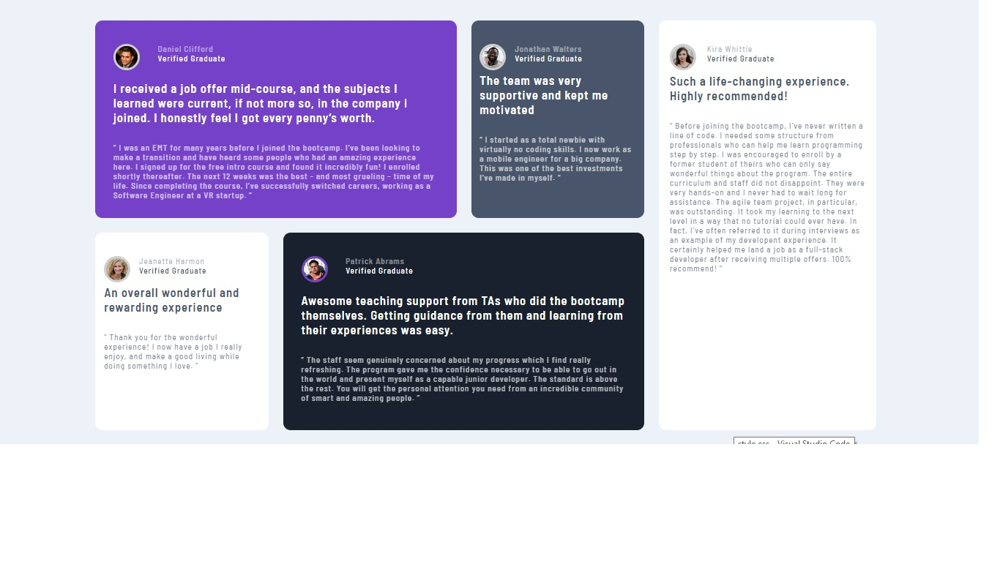

# grade_de_depoimentos

## Visão geral

### O desafio

Esta página é um desafio do FrontEnd Mentor.

Os usuários devem ser capazes de:

- Ver o layout ideal para o site, dependendo do tamanho da tela do dispositivo

### Captura de tela




### Links

- URL da solução: [Abrir página do projeto](https://cheerful-parfait-ad9382.netlify.app/)

## Meu processo

### Construído com

- Marcação HTML5 semântica
- Propriedades personalizadas CSS
- Flexbox
- Grade CSS

### O que eu aprendi

O que me desafiou a implementar esta página foi a possibilidade de um novo aprendizado: o CSS grid. Também foi uma forma de treinar meu olho para trazer uma solução o mais próximo possível do design.


Para ver como você pode adicionar trechos de código, veja abaixo:

```html
<h1>Algum código HTML do qual me orgulho</h1>
```
```css
.proud-of-this-css {
  cor: mamão chicote;
}
```
```js
const proudOfThisFunc = () => {
  console.log('🎉')
}
```


### Desenvolvimento contínuo

Desejo continuar evoluindo meus conhecimentos em HTML e CSS, até que me sinta totalmente confortável com esses recursos. Também desejo refinar e aperfeiçoar projetos anteriores.


### Recursos úteis

- [Site para deploy](https://www.netlify.com) - Isso me ajudou para executar meu projeto. 
- [Site sobre CSS grid](https://css-tricks.com/snippets/css/complete-guide-grid/) - Este é um site incrível que me ajudou a entender CSS Grid. Recomendo a todos que ainda estão aprendendo esse conceito.


## Autor

- Frontend Mentor - [@Nolyanne](https://www.frontendmentor.io/profile/Nolyanne)


## Agradecimentos

Agradeço ao colega Fabrício Dourado, da comunidade CODE, pelo feedback em meu projeto anterior e por abrir meu horizonte sobre CSS.
